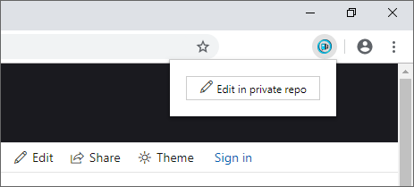

# Azure Docs Edit Launcher

This browser extension opens the original location of an Azure docs article for editing in the private repository.

## Installation and usage

1. Install via the [Google web store](https://chrome.google.com/webstore/detail/edit-page-azure-docs/kfdadnfiopehhcedhlflpioebhihpkia).
1. Navigate to an article on *docs.microsoft.com*
1. Click the extension icon
1. Click **Edit in private repo**

## FAQ

### What if I don't have access to the private repo?

If you don't have access, then you'll need to send a request to the content team to grant you access.

### Why does it tell me a page is not editable after I click the edit button?

Some pages on docs.microsoft.com don't feature an edit button rendered on the page. This button is required for the extension to work.
